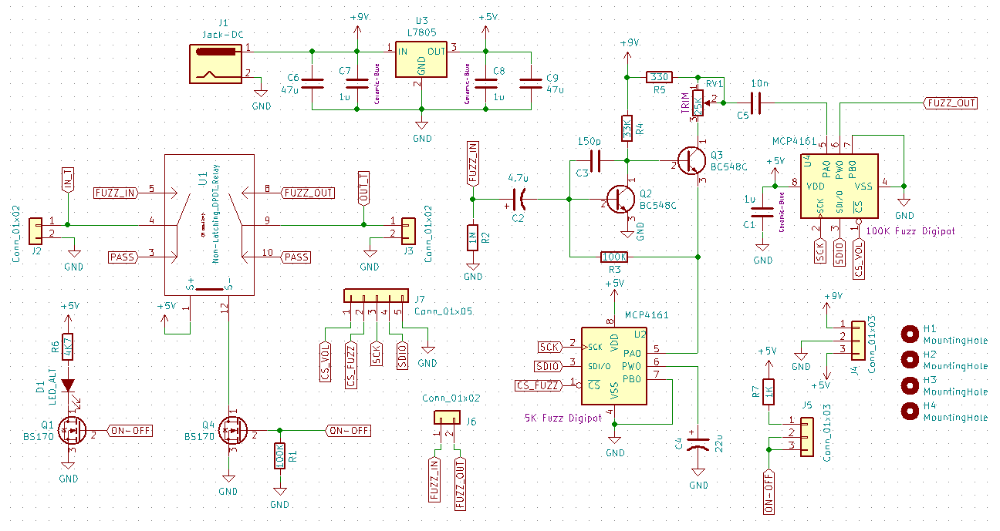

# Web Interfaced Pedal

## Quickstart

Plug pedal into 9V DC power supply, input, and output cables (like most guitar pedals).


Wait approximately 15 seconds, and then search for the Wifi Network “Pedal” on your computer. Open your web browser and open [http://pedal.local](http://pedal.local) if on Mac, otherwise open [http://192.168.4.1](http://192.168.4.1). The pedal can now be controlled via the web interface.


## Goal

The goal of this project was to create an electric guitar pedal that had the ability to be wirelessly controlled from any browser, by means of a local wifi connection. We had arbitrarily chose the ‘fuzz’ type pedal due to it’s analog simplicity (two high gain transistors). What follows is a brief report on the methodologies and results.

# Documentation

## Software

The pedal acts as a wireless access point allowing anyone nearby to connect to it from their network preferences. There is also a web server running on the pedal, which controls the pedal via two digital potentiometers connected to the GPIO pins of the embedded Raspberry Pi.

### Server

The server is written in Python using the [Tornado](http://www.tornadoweb.org/) web framework. This allows for fast and asyncronous websocket connects for low-latency controls. The websocket handler uses [spidev](https://github.com/doceme/py-spidev) to control the digitpots through an SPI interface, and [RPi.GPIO](https://sourceforge.net/projects/raspberry-gpio-python/) to control the relay.

### Frontend

The frontend of the website uses [Vue.js](https://vuejs.org/) to dynamically display and update the pedal controls.

### Installing Software on a New Raspberry Pi Zero

The board used for this project is a Raspberry Pi Zero W. Download the latest [Raspbian Lite Image](https://downloads.raspberrypi.org/raspbian_lite_latest) and flash it to your SD card. I recommend using [Etcher](https://www.balena.io/etcher/). Before ejecting the SD card, navigate to the SD card filesystem and do the following: Edit **config.txt** and append dtoverlay=dwc2 to the end of the file. Edit **cmdline.txt** and add modules-load=dwc2,g_serial after root separated by a single space on either side. Finally create a file called **ssh** (no extension) in the same directory.

Plug the Raspberry Pi into your computer via the center micro-USB connector. After waiting a few moments for the Pi to boot, you will be able to connect to the Pi as an ethernet device in your network settings. You can now ssh to the Pi with the following command: ssh pi@raspberry.local. The password will be “raspberry.” Now that you have a shell open, you can proceed to configuring the Access Point.

#### Configuring the Access Point

Update system:

```shell
sudo apt update && sudo apt upgrade
```

Install software:

```shell
sudo apt install dnsmasq hostapd
sudo systemctl stop dnsmasq
sudo systemctl stop hostapd
sudo reboot
```

_Note: the system will reboot so you will have reconnect to it like before._

Configure static IP:

```shell
sudo nano /etc/dhcpcd.conf
```

_Edit file so it looks like:_

```
interface wlan0
    static ip_address=192.168.4.1/24
    nohook wpa_supplicant
```

Restart dhcpcd:

```shell
sudo service dhcpcd restart
```

Backup and edit dnsmasq config:

```shell
sudo mv /etc/dnsmasq.conf /etc/dnsmasq.conf.orig

sudo nano /etc/dnsmasq.conf
```

_Add the following:_

```
interface=wlan0      # Use the wireless interface - usually wlan0
  dhcp-range=192.168.4.2,192.168.4.20,255.255.255.0,24h
```

Configure hostapd:

```shell
sudo nano /etc/hostapd/hostapd.conf
```

_Add the following:_

```
interface=wlan0
driver=nl80211
ssid=Pedal
channel=7
```

Then:

```shell
sudo nano /etc/default/hostapd
```

Replace:

```
DAEMON_CONF="/etc/hostapd/hostapd.conf"
```

Edit kernel parameters:

```shell
sudo nano /etc/sysctl.conf
```

Uncomment this line:

```
net.ipv4.ip_forward=1
```

Add a masquerade for outbound traffic on eth0:

```shell
sudo iptables -t nat -A  POSTROUTING -o eth0 -j MASQUERADE
```

Save the iptables rule:

```shell
sudo sh -c "iptables-save > /etc/iptables.ipv4.nat"
```

Edit /etc/rc.local:

```shell
sudo nano /etc/rc.local
```

Add this just above "exit 0" to install these rules on boot:

```shell
iptables-restore < /etc/iptables.ipv4.nat
```

#### Install the Pi-Pedal software

Install git and pip:

```shell
sudo apt install git python-pip
```

Clone the pi-pedal code from my repository:

```shell
git clone https://github.com/teddykoker/pipedal
```

Install requirements:

```shell
sudo pip install -r pipedal/requirements.txt
```

Edit /etc/rc.local:

```shell
sudo nano /etc/rc.local
```

Add this just above "exit 0" to run on boot:

```
/home/pi/pipedal/pedal.py
```

Edit hostname:

```shell
sudo nano /etc/hostname
```

Replace name with `pedal`

## Hardware

### Schematic



A 9v linear regulator (LT 7805) can be seen on the top left of the schematic, with the relay system on the middle left, and digital MOSFET toggle control on the bottom left. On the right of the schematic is the necessary analog circuitry to produce the fuzz effect, with all of the connectors that will be required on the PCB, to connect to the Raspberry Pi inside the enclosure. The fuzz circuitry is based around the two high gain (BC548 transistors).

### Version 1: Breadboard


The breadboard circuitry follows directly from the general schematic. Just to point out key components for quick reference - the relay is in orange, the manually latching pedal switch is on the bottom right, the two audio connectors are on the top right. The blue breakout board is to connect the Raspberry’s male header pins to the breadboard. The two DIP8 ICs on the left breadboard are the digital potentiometers controlled by the raspberry pi. The one on the top controls volume, and the one on the bottom controls the fuzz saturation. Both are interfaced to the RasPi via SPI.On the bottom left you can see two bigger (47u) audio capacitors and a heatsinked linear regulator to produce a 5v rail from the 9v wall adapter. There is an issue with this power supply however. This specific variant of 7805 IC apparently cannot handle the current needed by the Raspberry Pi on bootup, and the 5v rail wiggles as the UVLO circuitry of the raspberry pi starts and stops. The PCB mentioned later does not have this problem for whatever reason.

#### Issues with Schematic

1. Connection from ON-OFF to the RasPi must be done with a 10K ohm resistor - not directly.
2. The 9v connector is technically backwards in the PCB schematic - the footprint has to be reversed.

### Version 2: PCB and Enclosure

The PCB was designed from the same exact schematic as the breadboard was built from. The software used was the free and open source KiCAD, from EDA. The manufacturer of the PCB was OSHPark, a U.S. based rapid-prototyping company.

#### Issues with PCB variant

The fuzz circuitry isn’t working at all in the new PCB. There is absolutely no coupling of any sound through the fuzz circuitry. Everything else works though - after heavy modification. The relay is able to flip from wireless control using the RasPi, and the audio-pass functionality (when the pedal is off) passes the audio to the output undisturbed. One the pedal is turned on, and fuzz is supposed to be applied, no audio is passed through, denoting an issue with just the fuzz circuitry. Keep in mind that these issues are only with the PCB variant, not with the breadboard variant. The breadboard completely works except for the overcurrenting of the 7805 regulator.


# Next Steps

1. Hardware fixes:
   1. Correct reversal of 9v barrel jack footprint
   2. Add in 10 kOhm resistor
   3. Properly diagnose the 5v linear regulator, and completely understand why is wasn’t working on the breadboard - so we could better prevent this issue in the future - even though it worked on the PCB.
   4. Properly electrically test the fuzz circuitry with a function generator and an oscilloscope (there are direct FUZZ_IN and FUZZ_OUT male headers on the board for diagnosis) and determine what the mode of failure is.
2. Allow saving/restoring of guitar pedal settings
3. Add more effects
